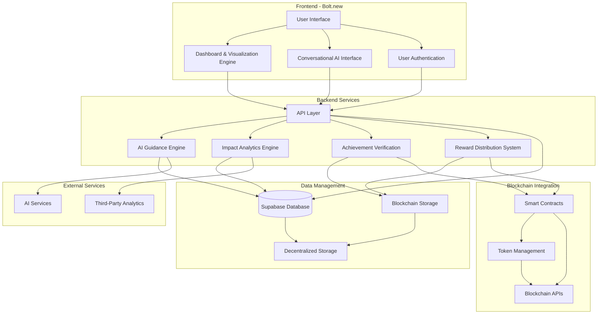
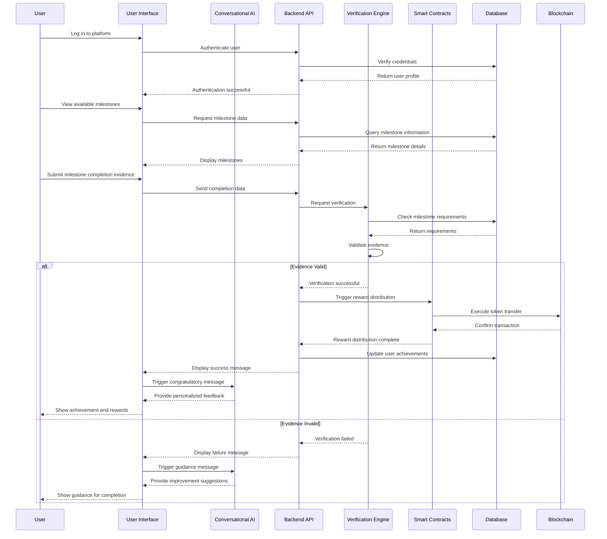
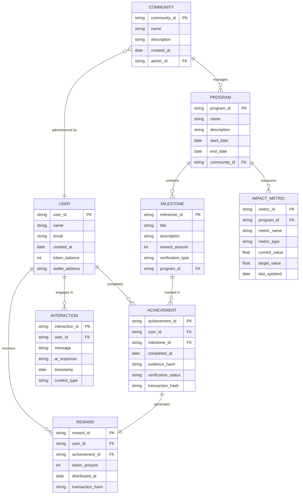

# AI-Powered Community Impact Tracker: Architecture Diagrams

Based on the previously created Product Requirements Document (PRD) for the AI-Powered Community Impact Tracker, the following architecture diagrams illustrate the system's components, interactions, and data flow. These diagrams provide a comprehensive visual representation of how the application will leverage Bolt.new, blockchain technology, and AI to track community development program impacts[1][2].

## System Architecture Overview

The architecture follows Bolt.new best practices for web application development, emphasizing modularity, scalability, and integration with blockchain networks[1][3]. The diagrams below represent different views of the system architecture, from high-level component relationships to detailed data flows and entity relationships[4].

### High-Level Architecture Diagram



This diagram illustrates the primary components of the system and their relationships[5][4]. The frontend, built with Bolt.new, connects to backend services that handle AI guidance, impact analytics, achievement verification, and reward distribution[1][6]. The system integrates with blockchain networks for transparent verification and token management, aligning with the R2PIP framework outlined in the whitepaper[7][6].

## Component Flow Diagram

```mermaid
flowchart LR
    subgraph "User Interaction Layer"
        User((User))
        User --> |Accesses| WebApp[Web Application]
        WebApp --> |Authenticates| Auth[Authentication]
        WebApp --> |Views| Dash[Impact Dashboard]
        WebApp --> |Interacts with| ChatBot[AI Chatbot]
        WebApp --> |Completes| Milestones[Milestone Tracking]
    end
    
    subgraph "Application Layer"
        Auth --> |Verifies| UserMgmt[User Management]
        Dash --> |Requests Data| DataViz[Data Visualization]
        ChatBot --> |Processes| NLP[NLP Engine]
        Milestones --> |Records| AchievementTracker[Achievement Tracker]
        
        DataViz --> |Queries| DataAPI[Data API]
        NLP --> |Accesses| AIModelAPI[AI Model API]
        AchievementTracker --> |Verifies| VerificationAPI[Verification API]
    end
    
    subgraph "Service Layer"
        DataAPI --> |Processes| AnalyticsEngine[Analytics Engine]
        AIModelAPI --> |Uses| AIGuidance[AI Guidance System]
        VerificationAPI --> |Triggers| SmartContractAPI[Smart Contract API]
        
        AnalyticsEngine --> |Stores| DataStorage[Data Storage]
        AIGuidance --> |Logs| InteractionDB[Interaction Database]
        SmartContractAPI --> |Executes| TokenRewards[Token Reward System]
    end
    
    subgraph "Infrastructure Layer"
        DataStorage --> |Hosted on| Supabase[(Supabase)]
        InteractionDB --> |Hosted on| Supabase
        TokenRewards --> |Connects to| Blockchain[(Blockchain Networks)]
        
        Supabase --> |Secured by| Security[Security Protocols]
        Blockchain --> |Verified by| Consensus[Consensus Mechanism]
    end
    
    subgraph "External Integrations"
        AIGuidance  |Integrates with| ExternalAI[External AI Services]
        AnalyticsEngine  |Connects to| ThirdPartyData[Third-Party Data Sources]
        TokenRewards  |Interacts with| CryptoExchanges[Crypto Exchanges]
    end
```

This component flow diagram provides a more detailed view of how data and interactions flow through the system[8][9]. It illustrates the layered architecture approach, from user interaction through application logic to service implementation and infrastructure[3][5]. The diagram highlights how the system integrates with external services and blockchain networks to provide a comprehensive community impact tracking solution[6][10].

## Milestone Completion Sequence Diagram



This sequence diagram illustrates the process flow for milestone completion and reward distribution[4][9]. It shows how users interact with the system to submit evidence of milestone completion, how the verification engine validates this evidence, and how smart contracts automatically distribute token rewards upon successful verification[7][6]. The diagram also demonstrates how the conversational AI provides personalized guidance and feedback throughout the process[10].

## Database Entity Relationship Diagram



This entity relationship diagram defines the database structure for the application[4][9]. It shows the relationships between users, communities, programs, milestones, achievements, rewards, and impact metrics[7][10]. The diagram illustrates how the system tracks user interactions, milestone completions, and impact measurements, providing a comprehensive data model for the community impact tracking platform[5][8].

## Architecture Implementation Notes

### Bolt.new Integration

The application will be built using Bolt.new's development environment, leveraging its React-based frontend capabilities and Node.js backend services[1][2]. This approach aligns with Bolt.new best practices for building complex web applications with AI integration[3][5]. The architecture is designed to be modular and scalable, allowing for iterative development within the 2-week hackathon timeline[8].

### Blockchain Implementation

The blockchain integration follows the R2PIP whitepaper specifications, supporting both Ethereum and Binance Smart Chain networks[7][6]. Smart contracts will handle achievement verification and token reward distribution, ensuring transparency and security in the incentive program[7]. The architecture includes token management components that align with the R2PIP tokenomics model, supporting the R2P token for rewards and services within the platform[7].

### AI Guidance System

The conversational AI component is designed to provide personalized guidance to users throughout their journey[10]. It will track user progress, offer motivational feedback, and suggest actionable next steps based on the user's current status and goals[3][8]. The AI system integrates with the milestone tracking and impact measurement components to provide context-aware assistance[10].

### Data Security and Privacy

The architecture incorporates multiple layers of security, including encryption for user data, decentralized storage for sensitive information, and blockchain-based verification for achievements and rewards[7][6]. User authentication is managed through Supabase's secure authentication system, with optional blockchain-based identity verification for enhanced security[5][8]. The system follows best practices for data privacy and compliance, ensuring the protection of personal information and community data[1][3].

## Conclusion

The architecture diagrams presented above provide a comprehensive visual representation of the AI-Powered Community Impact Tracker system[4][9]. They illustrate how the application will leverage Bolt.new, blockchain technology, and AI to create a transparent, efficient, and scalable platform for tracking community development program impacts[1][6]. The architecture is designed to support the objectives outlined in the PRD and align with the R2PIP framework, creating a unique solution that addresses the challenges faced by underserved communities[7][10].

